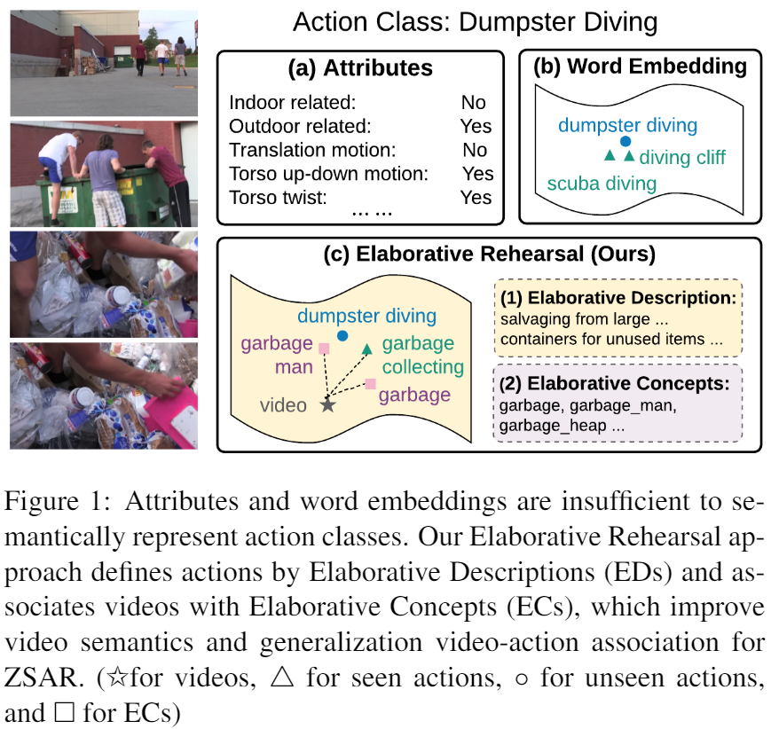
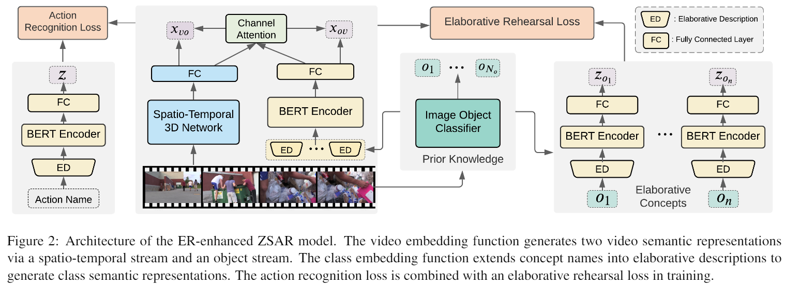
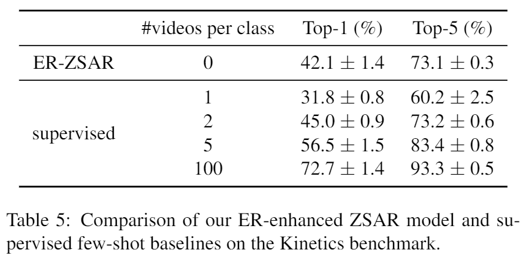

# Elaborative Rehearsal for Zero-shot Action Recognition
  
This is an official implementation of:

**Shizhe Chen and Dong Huang**, ***Elaborative Rehearsal for Zero-shot Action Recognition***, ICCV, 2021. 

Elaborating a new concept and relating it to known concepts, we reach the dawn of zero-shot action recognition models being comparable to supervised models trained on few samples.

New SOTA results are also achieved on the standard ZSAR benchmarks (Olympics, HMDB51, UCF101) as well as the first large scale ZSAR benchmak (we proposed) on the Kinetics database.  

 



### Citation: 

```bash
@proceeding{ChenHuang2021ER,
  title={Elaborative Rehearsal for Zero-shot Action Recognition},
  author={Shizhe Chen and Dong Huang},
  booktitle = {ICCV},
  year={2021}
}
```
